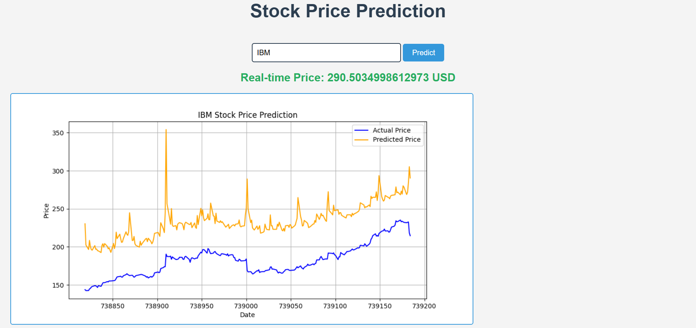

# Stock Price Prediction Application

## Overview

The Stock Price Prediction Application is a web-based tool that allows users to predict the stock prices of various companies in real-time. By entering a stock ticker symbol, users can retrieve the predicted price and view a corresponding graph of the prediction.

## Features

- **Real-time Stock Price Prediction:** Users can input stock ticker symbols to get predicted prices.
- **Visualization:** The application generates a graph to visualize stock price predictions.
- **User-Friendly Interface:** Simple and intuitive web interface for easy access.

## Technologies Used

- **Python:** Backend development using Flask framework.
- **HTML/CSS/JavaScript:** Frontend development for user interface.
- **Machine Learning:** Linear regression for stock price prediction.
- **Matplotlib:** Graph generation for visualizing predictions.

## Setup Instructions

1. Clone the repository:
   ```bash
   git clone https://github.com/kramit624/StockPricesPredictor.git
   ```
2. Navigate to the project directory:
   ```bash
   cd StockPricesPredictor
   ```
3. Create a virtual environment:
   ```bash
   python -m venv venv
   ```
4. Activate the virtual environment:
   - On Windows:
     ```bash
     venv\Scripts\activate
     ```
   - On macOS/Linux:
     ```bash
     source venv/bin/activate
     ```
5. Install the required packages:
   ```bash
   pip install -r requirements.txt
   ```
6. Run the application:
   ```bash
   python app.py
   ```
7. Open your web browser and navigate to `http://127.0.0.1:5000`.

## Usage

1. Enter the stock ticker symbol (e.g., AAPL, MSFT) in the input field.
2. Click the "Predict" button to see the predicted stock price and a visualization of the prediction.

## Example Output

Here’s an example of the output generated by the application:



## Contributing

Contributions are welcome! If you have suggestions for improvements or new features, please fork the repository and submit a pull request.

## License

This project is licensed under the MIT License - see the [LICENSE](LICENSE) file for details.
